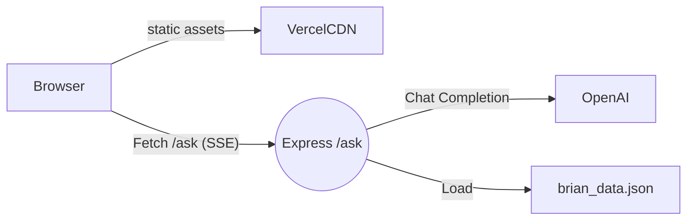

# System Patterns

## Architecture Overview

- Static pages and assets are served from Vercel’s CDN.
- The AI chat UI makes an HTTP POST to `/ask`, which streams Server-Sent Events (SSE) back to the browser.
- Express backend composes a system prompt with data from `brian_data.json` and forwards the request to OpenAI.

## Key Technical Decisions
- Use **Express** for serverless backend instead of Next.js API routes to allow streaming SSE with fine-grained control.
- Keep portfolio pages as plain HTML/CSS for faster load and simpler authoring.
- Store AI knowledge in version-controlled JSON so responses are deterministic and auditable.
- Deploy both static content and Node function in a single Vercel project for simple CI/CD.

## Design Patterns in Use
- **Separation of Concerns**: front-end (static) vs backend (AI API).
- **Adapter Pattern**: Express `/ask` adapts OpenAI chat completion into a streaming SSE endpoint.
- **Configuration via Env Vars**: OpenAI key, server port.

## Component Relationships
- `public/ai.html` (or experimental `pages/ai.js`) embeds JS that calls `/ask`.
- `/ask` endpoint loads `brian_data.json` → builds system prompt → streams GPT answer.
- Other pages (`index.html`, `work.html`, etc.) are independent static pages that share global SCSS styles.